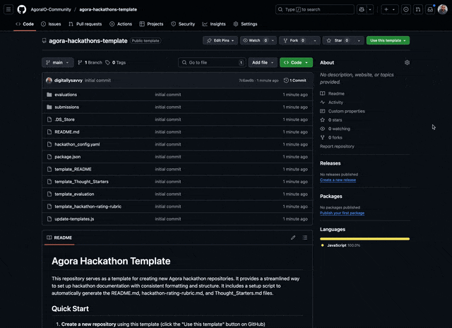

# Agora Hackathon Template

This repository serves as a template for creating new Agora hackathon repositories. It provides a streamlined way to set up hackathon documentation with consistent formatting and structure. It includes a setup script to automatically generate the README.md, hackathon-rating-rubric.md, and Thought_Starters.md files.

## Quick Start

1. **Create a new repository** using this template (click the "Use this template" button on GitHub)  
   
2. **Update the configuration** in `hackathon_config.yaml` with your event details
3. **Run the generator**:
   ```bash
   npm install
   npm run setup
   ```
4. **Review and commit** the customized files

That's it! The setup script will automatically generate all necessary documentation files and clean up after itself.

## What Gets Generated

The generator will create three main files:

1. `README.md` - Main hackathon documentation
2. `hackathon-rating-rubric.md` - Judging criteria and scoring
3. `Thought_Starters.md` - Project ideas and inspiration
4. `evaluation_template.md` - Evaluation template based on the judging criteria

## Configuration

The `hackathon_config.yaml` file contains all the customizable elements:

- `event`: Event details
- `theme`: Hackathon theme and focus areas
  - `type`: Either 'specific' or 'open'
  - `title`: Theme title (for specific themes)
  - `description`: Theme description
  - `focus_areas`: List of specific areas to focus on
  - `technologies`: List of recommended technologies
- `contact`: Contact information
- `submission_guidelines`: Submission guidelines
- `judging_criteria`: Judging criteria
- `thought_starters`: Project ideas and inspiration

## After Generation

After running the generator:

1. Review the generated files
2. Make any necessary manual adjustments
3. Commit the changes to your repository

## Support

For questions or issues, please contact the Agora Developer Relations team.
